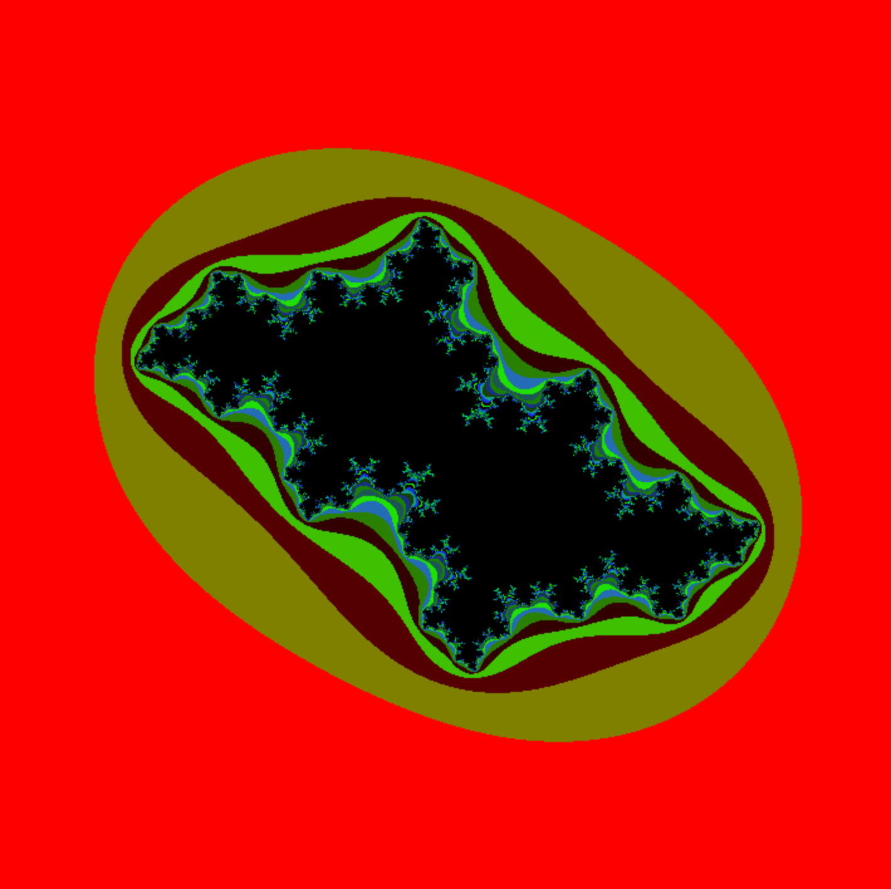

# fract-ol

## Example
### mandelbrot
<p align="center">
  
  
  
</p>

### julia
<p align="center">
  
  
  
  
  
  
</p>

## Execution environment
- iMac
- m1 macbook air


## Usage
### compile
```
make
```

### execute
- mandelbrot
```
./fractol mandelbrot
```

- julia
```
./fractol julia 0.32 0.043
./fractol julia 0.27334 0.00742
./fractol julia -0.15652 1.03225
./fractol julia -0.12 0.74
./fractol julia -0.39054 -0.58679
./fractol julia 0.11031 -0.67037
./fractol julia -0.74543 0.11301
```